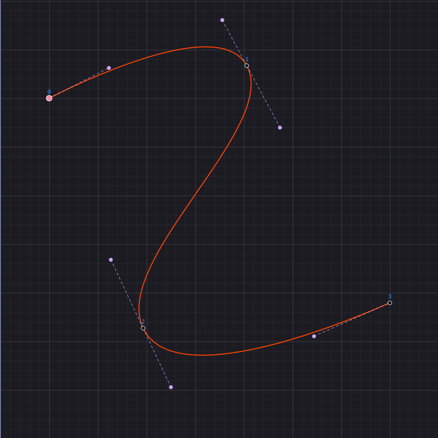

# Curve Fitter and Stroker

## Curve Fitter

This is a rust port of Raph Levien's smooth curve fitting using Two parameter curve approach.
Given a series of points, it constructs a smooth curve connecting all those points.

* Article: https://raphlinus.github.io/curves/2018/12/21/new-spline.html
* Paper: https://spline.technology/paper1.pdf
* Javascript implementation and demo: https://github.com/raphlinus/spline-research
* LICENSE MIT or Apache

This Rust port is also licensed under MIT

## Variable Stroker

The Kurbo library has a stroke algorithm to expand a path (skeleton or a list of
connected Cubic curves) with a given offset `d`. It works well and is based on extensive
research by the Kurbo team.

I adapted the system to try variable stroking where the value of `d` varies at curve joints.
This is useful in illustrating variable thickness letters. It reuses most of the
code from the Kurbo library. Wherever the constant value `d` is used, a value from an array of varying
widths is supplied.

The resulting stroke outline is acceptable to the eye,
but not great in terms of the number of points in the outline.

My objective was to see if such outlines can be used in type engineering (font making),
especially for variable fonts. However, variable fonts need interpolatable shapes.
They need the same number of points in all variations. The unpredictable number of points
in the outline as the input widths change is not acceptable for that workflow.
Simplification APIs are not usable as they also add non-deterministic points.

## Interpolatable Variable Strokes

A simple stupid trick I have used in this repo for achieving interpolation
is to make the sub-divisions of the outline
for a path segment deterministic. Initially I used 4 sub-divisions for every path segment.
But later I changed it to dynamic based on the curvature of the source path.
The resulting curves are interpolatable but lost the perfection from the previous step
where the stroke calculation was based on a complex error reduction strategy. My approach reduced that to a
simpler Tiller-Hanson-like approach.

When I shared this work with the Kurbo team, Raph suggested using a linear perturbation system

$B_{offset}(t) = B(t) + c \cdot D(t)$

*   **$B(t)$**: This is our **Source Spine** (the cubic Bézier you are stroking).
*   **$c$**: This is the **Scalar Width** (or half-width). In a variable stroke, this is our $w(t)$.
*   **$D(t)$**: This is a **"Direction Curve"**. It represents the Normal Vector, but approximated as a cubic Bézier itself.

Intuitively, instead of trying to calculate a perfect parallel curve
(which is mathematically impossible to represent exactly as a Bézier),
we are creating a "vector field" that points outwards from the curve.

1.  Define a curve $D(t)$ that represents "Straight Out" (Normal) along the spine.
2.  To generate the offset, take the spine point $B(t)$ and add $D(t)$ multiplied by the width at that point.

Why does this guarantee interpolatability? If you have a "Thin" shape and a "Bold" shape,
they share the exact same $B(t)$ and $D(t)$. The *only* thing that changes is $c$ (the width).
Because the formula is **linear** (it's just addition), point $P_{offset}$
moves in a straight line as you increase the weight.
This is the definition of perfect variable font interpolation.

Instead of my dynamic curvature-based sub-divisions, Raph recommended using a single midpoint.
Since we know the start point (from $t=0$) and the end point (from $t=1$),
and we know the tangents (from the derivative formula below),
we still have degrees of freedom: **how long are the control handles?**
Raph suggests calculating the exact offset point at $t=0.5$ (the middle).
You then mathematically solve for the handle lengths that force the cubic curve to pass through that middle point.
This is deterministic and fast.

The endpoint tangents for variable offset are $(1 + \kappa d)x' + n d'$

This formula tells you exactly **what direction the offset curve is pointing** at any moment $t$.

$$ \text{Tangent}_{offset} = \underbrace{(1 + \kappa d)x'}_{\text{Part A}} + \underbrace{n d'}_{\text{Part B}} $$

#### **Part A: The "Parallel" Movement**
*   **$x'$**: This is the tangent of the spine (moving forward along the road).
*   **$d$**: The current width.
*   **$\kappa$ (Kappa)**: The curvature (how tight the turn is).

#### **Part B: The "Taper" Movement** - sideways push
*   **$n$**: The Unit Normal (pointing 90° sideways).
*   **$d'$**: The **Derivative of Width** (The slope). How fast is the width changing?

If the pen is getting wider ($d' > 0$), the edge of the ink must move **outwards** away from the center. This adds a sideways vector component.

This approach had one limitation though. While the outline curve is smooth for a segment, at segment joints,
kinks(sharp jumps) can happen we suuch segments are joined.
Since the tangent calculation based on $(1 + \kappa d)x' + nd'$ need some updates to handle the case of segment joins I guess. The sideways movement of the stroke) based on how much the width changes per segment  - $$d'$$ but when segment A and B has different lengths, the rate change is rapid in some cases. this changes the angle of the offset curve, creating the kink you see here:

So we need an error correction mechanism at segment joins to get $G_1$ continuity.

## Error Correction Based on Skeleton

The variable-width stroking process, while mathematically elegant, introduces challenges at segment boundaries where the width changes dynamically. The stroke outline can have G₁ continuity errors (directional discontinuities) at these joints due to the complex interplay between curvature, width taper, and segment transitions.

To address this, we employ a **two-stage error correction strategy** that leverages the original skeleton (the input curve) as a reference guide for fixing problematic points.

### The Core Problem

When we stroke a curve with variable width using the linear perturbation formula:

$$B_{offset}(t) = B(t) + w(t) \cdot D(t)$$

The offset curve is smooth within each segment, but at segment joints where two different segments meet, discontinuities can emerge. This happens because:

1. **Width derivative changes**: The rate of width change ($$d'$$) differs between adjacent segments
2. **Curvature discontinuities**: The skeleton may have different curvatures at segment joints
3. **Normal vector discontinuities**: The direction curve $$D(t)$$ may shift abruptly between segments

These combine to create **kinks** in the stroke outline where the tangent direction changes abruptly.

### Our Solution: Selective Skeleton-Based Correction

We address this with a three-stage process embedded in the `refit_stroke()` function:

#### **Stage 1: Extract and Classify Outline Points**

When the stroke outline is generated, we extract its on-curve points (the corner-like features where segments join). At each point, we calculate:

- **Incoming tangent angle**: The direction the curve is heading into this point
- **Outgoing tangent angle**: The direction the curve is heading out of this point  
- **Point type**: Classify as either "Corner" (angles differ significantly) or "Smooth" (angles match)

The threshold for this classification is configurable (default: 15° for variable-width strokes).

#### **Stage 1b: Detect Misclassified Corners (With Skeleton)**

If skeleton information is available, we perform a second-pass analysis:

- Match each outline point to its closest skeleton point using spatial proximity (within 2.0 units)
- For points classified as "Corner" in the outline, check if they correspond to "Smooth" points in the skeleton
- If there's a mismatch, the outline point is likely a **false positive corner** caused by stroking artifacts rather than a real intentional corner

We correct these misclassified points by:
- Using the skeleton's tangent direction (which is stable and reliable)
- Replacing the problematic outline angles with the skeleton's incoming and outgoing angles
- Re-classifying the point as "Smooth"

#### **Stage 2: Detect and Correct G₁ Failures (With Skeleton)**

After initial classification and smoothing, we check for **G₁ continuity failures** — points where incoming and outgoing angles still differ by more than a tiny threshold (0.5°, indicating non-smoothness in the fitted curve).

For each failing point, if skeleton information is available:

1. **Geometric matching**: Find the closest skeleton point using the outline point's spatial location
2. **Angle extraction**: If a match is found, extract the skeleton's tangent angle at that location
3. **Selective correction**: Use the skeleton's angle to override the outline-derived angle at the failing point
4. **Propagation**: Re-apply G₁ smoothing to all neighboring points, which propagates the correction and helps neighboring points converge

The correction is **selective and conservative**:
- Only failing points are corrected
- Only if a confident skeleton match exists (spatial distance < 2.0 units)
- If the correction succeeds, we validate again; if it still fails, we continue anyway (graceful degradation)

#### **Stage 3: Fit the Refined Curve**

Once all corrections are applied, the outline points are passed through the curve fitting algorithm with:
- Corrected point classifications (fewer false corners)
- Corrected/validated tangent angles (ensuring G₁ continuity)
- The full constraint set from the two-parameter curve approach

The result is a clean, smooth curve that respects the original geometry while resolving the stroking-induced discontinuities.

### Two Modes of Operation

The `refit_stroke()` function supports two operating modes:

**Mode 1: Outline-Only Refitting** (`skeleton_info = None`)
- Extract on-curve points from the stroke outline
- Classify and smooth using outline-derived angles only
- Fit a curve through the corrected points
- Faster, but may retain some artifacts from variable-width stroking

**Mode 2: Skeleton-Aware Selective Correction** (`skeleton_info = Some(&skeleton)`)
- All of Mode 1, plus:
- Detect misclassified corners using skeleton reference
- Detect G₁ failures and correct them using skeleton angles
- Results in higher-quality curves closer to the original design intent
- Recommended for font engineering and precision applications

### Key Design Principles

1. **Preservation of Intent**: Skeleton points that are intentionally "Smooth" stay smooth; intentional "Corners" stay corners. We only fix artifacts.

2. **Graceful Degradation**: If skeleton matching fails for a point, that point is left as-is rather than causing the entire operation to fail.

3. **Conservative Correction**: We only correct points that have measurable problems (failing G₁ continuity). Well-behaved points are left untouched.

4. **Angle Reliability**: The skeleton's tangent angles are more reliable than those derived from the stroke outline, since they come directly from the fitted curve before stroking.

5. **Predictable Output**: By using the skeleton as a reference, output is deterministic and reproducible across different width variations — essential for variable font interpolation.

### Practical Impact

This two-stage approach enables:

- **Font Production**: Variable-width strokes can now be automatically optimized for use in fonts
- **Interpolation**: Different widths of the same shape produce curves with matching topology, supporting variable fonts
- **Quality**: Removes most stroking artifacts while preserving intentional design features
- **Speed**: The skeleton-based matching is fast (spatial lookup with 2.0 unit tolerance), so the correction overhead is minimal
