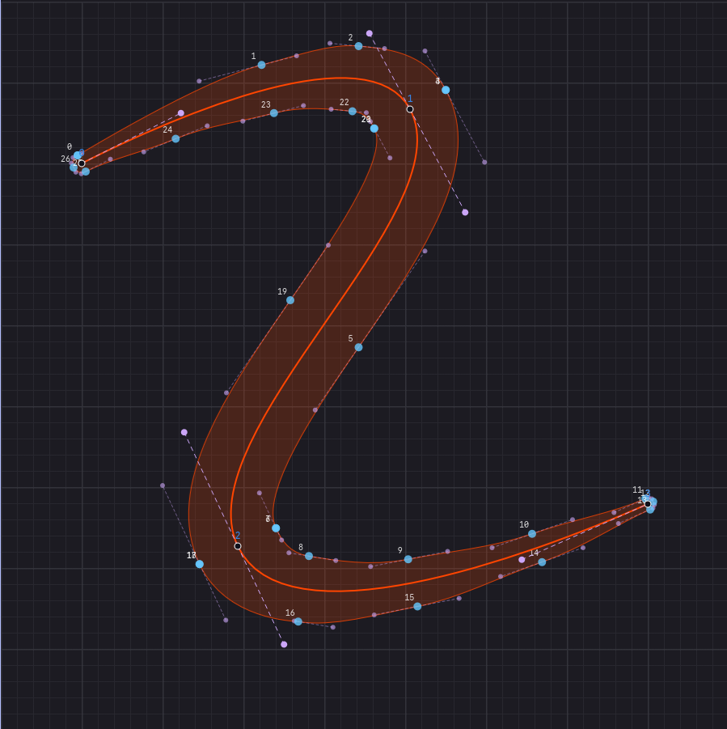

# Curve Fitter and Stroker

## Curve Fitter

This is a rust port of Raph Levien's smooth curve fitting using Two parameter curve approach.
Given a series of points, it constructs a smooth curve connecting all those points.

* Article: https://raphlinus.github.io/curves/2018/12/21/new-spline.html
* Paper: https://spline.technology/paper1.pdf
* Javascript implementation and demo: https://github.com/raphlinus/spline-research
* LICENSE MIT or Apache

This Rust port is licensed under MIT

## Variable Stroker

Kurbo library has stroke algorithm to expand a path (skeleton or a list of
connected Cubic curves) with a given offset `d`. It works well and based on extensive
research by Kurbo team.

I adapted the system to try variable stroke where the value of `d` varies at curve joints.
This is useful in illustrating variable thickness letters. It reuses most of the
code from Kurbo library. Wherever the constant value `d` is used, a value from array of varying
widths is supplied.

The resulting stroke outline is acceptable to eyes,
but not great in terms of number of points in the outline.

My objective was to see if such outlines can be used in the type engineering(font making),
especially in variable fonts. However, variable fonts need interpolatable shapes.
They need same number of points in all variations. The unpredictable number of points
in the outline as the input widths change is not acceptable for that workflow.
Simplify APIs are not usable as they also add non-deterministic points.

## Interpolatable Variable Strokes

A simple stupid trick I have used in this repo for achieving interpolation
is to make the sub-divisions of the outline
for a path segment deterministic. Initially I used 4 sub-divisions for every path segment.
But later changed it to dynamic based on the curvature of source path.
The resulting curves are interpolatable but lost the perfectness from the previous step
where the stroke calculation was based on complex error reduction strategy. My approach reduced that to
simpler Tiller-Hanson-ish approach

