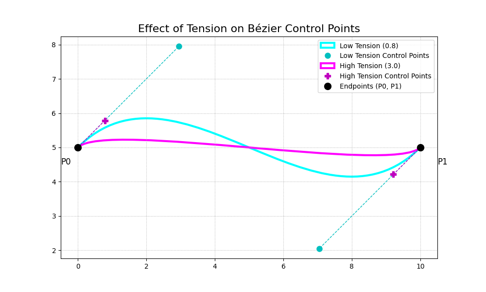

# Hobby's Curves

John Hobby's curve-fitting algorithm is renowned for its ability to generate
aesthetically pleasing, smooth curves that pass through a series of given
points. While many implementations focus on the algorithm's automatic smoothing
capabilities, often controlled by a "tension" or "curl" parameter, its true
power lies in the fine-grained control it offers over the curve's shape at each
node, specifically by allowing the user to specify entry and exit angles.

At its core, Hobby's algorithm is a sophisticated method for choosing the
control points of a sequence of cubic Bézier curves that smoothly connect a
series of nodes. Instead of requiring the user to manually place these control
points, the algorithm calculates their optimal positions to create a visually
pleasing curve.

The "magic" of Hobby's algorithm lies in its concept of **"mock curvature."**
Rather than dealing with the computationally complex true curvature, it uses a
simpler, linear approximation. The algorithm's primary goal is to make the mock
curvature continuous at each node. This means the curve's "turning rate" is the
same as it leaves one segment and enters the next, resulting in a smooth
transition.

To achieve this, the algorithm determines the optimal entry and exit angles for
the curve at each node. It sets up a system of linear equations where the
unknowns are these angles. The equations are designed to balance the angles at
each node to ensure this continuity of mock curvature.

## Installation

Add this library to your `Cargo.toml`:

```toml
[dependencies]
hobby = "0.1.0"
```

Or for local development:

```toml
[dependencies]
hobby = { path = "../hobby" }
```

## Quick Start

```rust
use hobby::{hobby, point::Point};
use std::collections::HashMap;

fn main() {
    // Define points for the curve to pass through
    let points = vec![
        Point::new(0.0, 0.0),
        Point::new(100.0, 50.0),
        Point::new(200.0, 0.0),
    ];

    // Generate the curve
    let segments = hobby(&points, None, false, None, None);

    // Each segment is a cubic Bézier curve with named fields
    for (i, segment) in segments.iter().enumerate() {
        println!("Segment {}: start={}, control1={}, control2={}, end={}", 
                 i, segment.start, segment.control1, segment.control2, segment.end);
    }
}
```

## Features

- **Automatic smooth curve generation** through any sequence of points
- **Configurable tension** at each point for curve tightness control
- **Directional constraints** via entry and exit angles
- **Cyclic curves** (closed loops)
- **WebAssembly support** for web applications
- **No external dependencies** (except nalgebra for linear algebra)

## Controlling the Curve

The key is to understand that when you provide an explicit angle for a node,
you are essentially removing a variable from the algorithm's system of
equations and replacing it with a constant.

*   **Default Behavior (No Specified Angles):** The algorithm treats the entry
and exit angles at each interior node as unknowns and solves for them to
achieve the smoothest possible curve based on the surrounding points.

*   **With Specified Angles:** When you specify an exit angle for a point `P_i`
and an entry angle for the next point `P_{i+1}`, you are directly telling the
algorithm the direction the curve must take at those points. These angles are
no longer variables to be solved for; they become fixed constraints. The
algorithm then solves the remaining system of equations for the unspecified
angles, ensuring the rest of the curve smoothly accommodates your constraints.

For example, with entry/exit angles, you are fixing the exit direction at the
first point to be 45 degrees and the entry direction at the last point to be
270 degrees. The algorithm will then determine the Bézier control points that
satisfy these endpoint conditions while still producing a smooth path between
them.

### Examples with Angle Control

```rust
use hobby::{hobby, point::Point};
use std::collections::HashMap;

let points = vec![
    Point::new(0.0, 0.0),
    Point::new(100.0, 100.0),
    Point::new(200.0, 0.0),
];

// Set exit angle at first point and entry angle at last point
let mut exit_angles = HashMap::new();
exit_angles.insert(0, 45.0); // Exit at 45 degrees from first point

let mut entry_angles = HashMap::new();
entry_angles.insert(2, -45.0); // Enter last point at -45 degrees

let segments = hobby(&points, None, false, Some(&entry_angles),
Some(&exit_angles));
```

### The Mathematical Framework

Hobby's algorithm works with the angles that the curve's tangent makes with the
chord connecting two consecutive points. Let's denote the points as `z_0, z_1,
..., z_n`. For a segment between `z_k` and `z_{k+1}`, the key variables are:

*   `θ_k`: The angle of the outgoing tangent at `z_k` with respect to the
chord `z_{k+1} - z_k`.
*   `φ_{k+1}`: The angle of the incoming tangent at `z_{k+1}` with respect to
the chord `z_{k+1} - z_k`.

The core of Hobby's algorithm is a set of equations that relate these angles to
ensure mock curvature continuity. For each interior node `z_k` (for `k = 1,
..., n-1`), the condition of mock curvature continuity leads to a linear
equation of the form:

`a_k * θ_k + b_k * φ_k = c_k`

where `a_k`, `b_k`, and `c_k` are coefficients determined by the positions of
the points `z_{k-1}`, `z_k`, and `z_{k+1}`, and the tension parameters. This
creates a **tridiagonal system of linear equations**, which can be solved
efficiently.

If you specify an exit direction at `z_k`, the angle `θ_k` is no longer an
unknown. It's a known value that you provide. Similarly, if you specify an
entry direction at `z_k`, `φ_k` becomes a known value.

When you provide these angles, the corresponding terms in the system of
equations are moved to the right-hand side, as they are now constants. This
modifies the system, but it remains a solvable tridiagonal system for the
remaining unknown angles.

## Tension

Our physical intuition suggests tension exists *along* something, like a rope,
not *at* a single point.

Hobby's genius was to reframe the problem. Instead of defining tension
"between" points, he defined a control parameter "at" each point that governs
the behavior of the curve as it passes *through* that point.

Let's break it down from intuition to mathematics.

### 1. The Core Intuition: A Knob at Each Point

Your intuition about tension being between two points is based on a physical
model, like stretching a rubber band between two nails.

Hobby's model is slightly different. Imagine your points are posts or nails
hammered into a board. The curve is a thin, flexible strip of wood (a spline)
that you are weaving through these posts.

Now, at each post, you have a **"stiffness knob"**. This knob controls how
tightly the strip of wood is forced to hug the post.

*   **Low Tension (e.g., `tension = 0.7`)**: This is like a "loose" knob. The
wooden strip is allowed to bulge and curve generously as it passes through the
post. The curve is "rounder" and "more relaxed."
*   **Default Tension (`tension = 1.0`)**: This is the default, aesthetically
pleasing setting that Hobby found to work well. It provides a balanced,
natural-looking curve.
*   **High Tension (e.g., `tension = 2.0`)**: This is like a "tight" knob. You
are forcing the wooden strip to become very straight on either side of the
post. The curve is pulled taut, becoming "flatter" and closer to the
straight-line path (the chord).
*   **Infinite Tension**: If you could turn the knob to infinity, the wooden
strip would become perfectly straight on either side of the post, turning the
smooth curve into a series of straight line segments.

So, **tension at a point controls the straightness of the curve segments that
connect *to* that point.** You are controlling a property of the node, and its
effect radiates out to the connected paths.

### 2. How It Works Mathematically

The effect of tension is implemented in two key places in the algorithm.

#### A. In the System of Equations

Recall the central equation that balances the angles at each node `k`. The
coefficients in that equation are what define the curve's "character." One of
the key coefficients is `alpha`:

`alpha_k = (tensions[k+1] * length_of_chord_k) / (tensions[k] *
length_of_chord_{k-1})`

Look closely at how the tensions are used:

*   `tensions[k]` is in the **denominator**.
*   `tensions[k+1]` is in the **numerator**.

This `alpha_k` value is a weight. It determines how much the angle at point `k`
is influenced by the direction of the *next* chord (`k+1`).

If you **increase `tensions[k]`**, you make `alpha_k` smaller. This **reduces
the influence** of the next part of the curve on the current point. The system
of equations will solve for angles that are more "local" and less
forward-looking, which results in a straighter path.

#### B. In the Calculation of Bézier Control Points

This is the most direct and easiest place to see the effect. After the
algorithm has solved for the optimal entry and exit angles (`phi` and `theta`),
it calculates the positions of the two Bézier control points for the segment
between `point_k` and `point_{k+1}`.

The formula for the first control point (`c1`) leaving `point_k` looks like
this:

`c1_distance = length_of_chord_k / (3.0 * tensions[k])`
`c1 = point_k + c1_distance * (vector in direction of exit angle)`

And for the second control point (`c2`) arriving at `point_{k+1}`:

`c2_distance = length_of_chord_k / (3.0 * tensions[k+1])`
`c2 = point_{k+1} - c2_distance * (vector in direction of entry angle)`

Notice that `tensions[k]` is in the denominator for the control point leaving
`point_k`, and `tensions[k+1]` is in the denominator for the one arriving at
`point_{k+1}`.

This has a very clear geometric meaning:

*   If you **increase `tensions[k]`**, the `c1_distance` gets **smaller**. This
pulls the control point `c1` closer to `point_k`.
*   If you **increase `tensions[k+1]`**, the `c2_distance` gets **smaller**.
This pulls the control point `c2` closer to `point_{k+1}`.

**Why does this matter?** In a cubic Bézier curve, the closer the control
points are to their respective endpoints, the "tighter" and "straighter" the
curve segment becomes. When a control point is very close to its endpoint, the
curve barely has time to bend before it's pulled back in the direction of the
next endpoint.



This diagram perfectly illustrates the effect. The top curve has lower tension,
so the control points (`c1`, `c2`) are farther from the endpoints (`P0`, `P1`),
allowing the curve to be full and round. The bottom curve has high tension,
pulling the control points in and making the path much more direct and flat.

### Example with Different Tensions

```rust
use hobby::{hobby, point::Point};

let points = vec![
    Point::new(0.0, 0.0),
    Point::new(100.0, 100.0),
    Point::new(200.0, 0.0),
];

// Different tension at each point
let tensions = vec![2.0, 1.0, 0.5]; // tight, normal, loose

let segments = hobby(&points, Some(&tensions), false, None, None);
```

## Angle Convention

The angle convention used in this entire setup is the **standard mathematical
and computer graphics convention**.

In short: **Angles increase in the counter-clockwise (anti-clockwise)
direction.**

### The Coordinate System

Let's establish the frame of reference first. We are using a standard Cartesian
coordinate system:

*   The **X-axis** increases horizontally to the **right**.
*   The **Y-axis** increases vertically **upwards**.

### The Angle Convention

Given this coordinate system, the angles are measured as follows:

*  **0 degrees:** Points directly to the right (along the positive X-axis).
This is "East".
*  **90 degrees:** Points directly up (along the positive Y-axis). This is
"North".
*  **180 degrees:** Points directly to the left (along the negative X-axis).
This is "West".
*  **270 degrees:** Points directly down (along the negative Y-axis). This is
"South".
*   **-90 degrees:** Is the same as 270 degrees (points down). Positive angles
go counter-clockwise, and negative angles go clockwise.

Here is a simple visual representation of the convention:

```
      +Y (90°)
       |
       |
135°   |   45°
_ _ _ _|_ _ _ _ +X (0°)
       |
225°   |   315°
       |
      -Y (270° or -90°)
```

### Why This Convention?

This convention is standard because it's the one used by the fundamental
trigonometric function `atan2(y, x)`. This function is used in both the Python
(`numpy.arctan2`) and Rust (`f64::atan2`) code to calculate the angle of the
chord connecting two points. Since the algorithm's internal calculations are
based on this standard, all user-provided angles must follow the same
convention to work correctly.

## WebAssembly Support

This library can be compiled to WebAssembly for use in web applications:

```bash
# Build for web
wasm-pack build --target web --features wasm

# The generated files will be in pkg/
```

### JavaScript Usage

```javascript
import init, { hobby_curve, WebPoint, HobbyOptions } from './pkg/hobby.js';

await init();

// Create points
const points = [
    new WebPoint(0, 0),
    new WebPoint(100, 100),
    new WebPoint(200, 0)
];

// Generate curve
const segments = hobby_curve(points);

// Or with options
const options = new HobbyOptions();
options.set_cyclic(true);
options.add_exit_angle(0, 45.0);

const segments_with_options = hobby_curve(points, options);
```

## API Reference

### Main Function

```rust
pub fn hobby(
    points: &[Point],
    tensions: Option<&[f64]>,
    cyclic: bool,
    entry_angles: Option<&HashMap<usize, f64>>,
    exit_angles: Option<&HashMap<usize, f64>>,
) -> Vec<BezierSegment>
```

**Parameters:**
- `points`: Array of points the curve should pass through (minimum 2)
- `tensions`: Optional tension values at each point (default: 1.0 for all)
- `cyclic`: Whether to create a closed curve (connects last point to first)
- `entry_angles`: Map of point indices to entry angles in degrees
- `exit_angles`: Map of point indices to exit angles in degrees

**Returns:**
- Vector of `BezierSegment` structs with fields: `start`, `control1`, `control2`, `end`

### Point Structure

```rust
pub struct Point {
    pub x: f64,
    pub y: f64,
}

impl Point {
    pub fn new(x: f64, y: f64) -> Self
    pub fn norm(&self) -> f64  // Distance from origin
    pub fn angle(&self) -> f64  // Angle in radians
}
```

### BezierSegment Structure

```rust
pub struct BezierSegment {
    pub start: Point,
    pub control1: Point,
    pub control2: Point,
    pub end: Point,
}

impl BezierSegment {
    pub fn new(start: Point, control1: Point, control2: Point, end: Point) -> Self
}
```

### WebAssembly API

```rust
// Main curve generation
pub fn hobby_curve(points: Vec<WebPoint>, options: Option<HobbyOptions>) ->
Vec<WebBezierSegment>

// Simple coordinate array interface
pub fn hobby_curve_simple(coords: Vec<f64>) -> Vec<WebBezierSegment>

// Generate SVG path string
pub fn hobby_to_svg_path(points: Vec<WebPoint>, options: Option<HobbyOptions>)
-> String
```

## Examples

### Basic Curve

```rust
use hobby::{hobby, point::Point};

let points = vec![
    Point::new(0.0, 0.0),
    Point::new(100.0, 50.0),
    Point::new(200.0, 0.0),
];

let segments = hobby(&points, None, false, None, None);

// Access segment data
for segment in segments {
    println!("Start: {}, End: {}", segment.start, segment.end);
    println!("Control points: {}, {}", segment.control1, segment.control2);
}
```

### Closed Curve with Tension

```rust
use hobby::{hobby, point::Point};

let points = vec![
    Point::new(0.0, 0.0),
    Point::new(100.0, 0.0),
    Point::new(50.0, 100.0),
];

let tensions = vec![2.0, 1.0, 0.5];
let segments = hobby(&points, Some(&tensions), true, None, None);
```

### Curve with Directional Constraints

```rust
use hobby::{hobby, point::Point};
use std::collections::HashMap;

let points = vec![
    Point::new(0.0, 0.0),
    Point::new(100.0, 100.0),
    Point::new(200.0, 0.0),
];

let mut exit_angles = HashMap::new();
exit_angles.insert(0, 45.0);  // First point exits at 45°

let mut entry_angles = HashMap::new();
entry_angles.insert(2, -45.0);  // Last point entered at -45°

let segments = hobby(&points, None, false, Some(&entry_angles),
Some(&exit_angles));
```

## Interactive Demo

A complete web-based interactive demo is available in the `web-demo/`
directory. It provides:

- Real-time curve manipulation
- Visual control point display
- Angle constraint controls
- SVG export functionality
- Touch support for mobile devices

To run the demo:

```bash
cd web-demo
python3 -m http.server 8000
# Open http://localhost:8000 in your browser
```

## References

* Typographers, programmers and mathematicians, or the case of an æsthetically
pleasing interpolation
  Bogusław Jackowski https://tug.org/TUGboat/tb34-2/tb107jackowski.pdf
* John Hobby's original paper: "Smooth, easy to compute interpolating splines"
* METAFONT: The Program by Donald Knuth

## License

This project is licensed under the MIT License - see the LICENSE file for
details.

## Contributing

Contributions are welcome! Please feel free to submit a Pull Request. For major
changes, please open an issue first to discuss what you would like to change.
